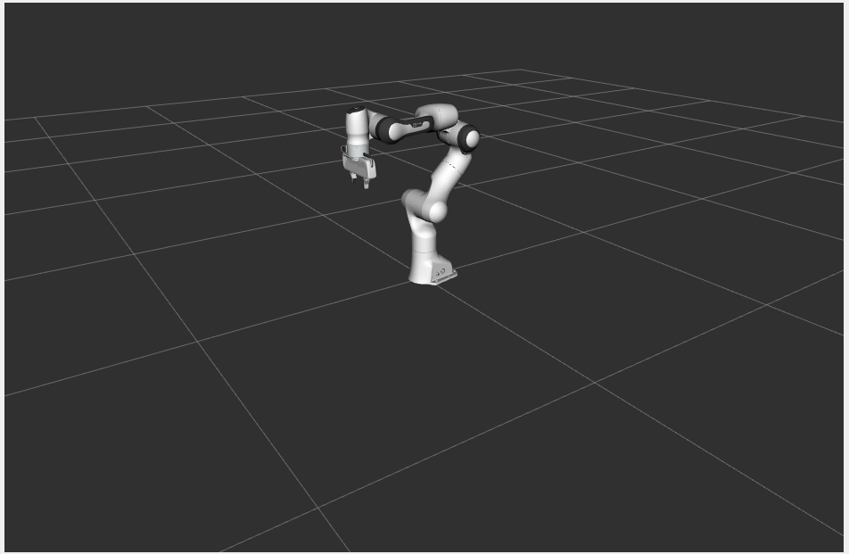
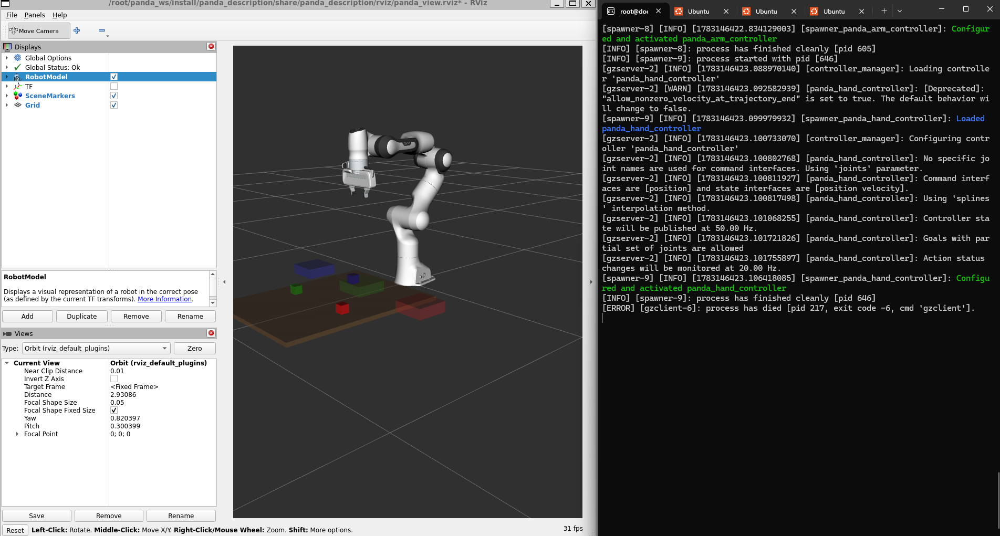
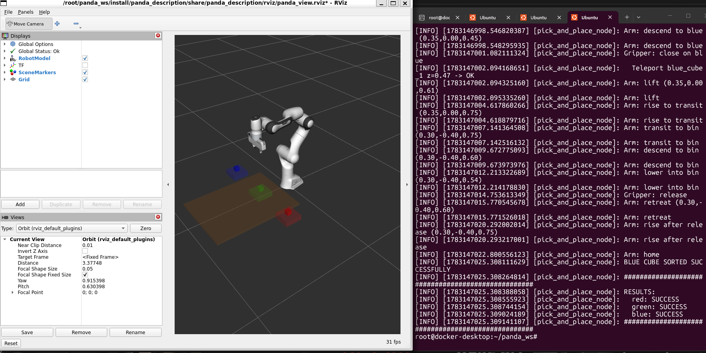

# 🤖 Franka Panda Color Sorting Robot

> A fully autonomous robotic arm that detects, picks, and sorts colored objects into matching bins — built from scratch using ROS 2, MoveIt 2, and Gazebo Classic inside Docker.

---

## 🎬 Demo

### ✅ Sorting Results — All 3 Cubes Successfully Sorted
### 🎥 RViz Sorting Demo Video

[](Demo_video/rviz_demo.mp4)

> Click above or open `Demo_video/rviz_demo.mp4` — shows the Franka Panda arm
> autonomously sorting all 3 colored cubes into their matching bins in real time.


```
[pick_and_place_node]: ##################################################
[pick_and_place_node]: RESULTS:
[pick_and_place_node]:   red:   SUCCESS ✓
[pick_and_place_node]:   green: SUCCESS ✓
[pick_and_place_node]:   blue:  SUCCESS ✓
[pick_and_place_node]: ##################################################
```

### 📸 RViz Visualization — Robot Arm in Action



### 📸 RViz — Sorting (All Cubes in Bins)



### ✅ Terminal Output — All 3 Cubes Successfully Sorted



### 🌍 Gazebo World — Table, Cubes, and Bins

<!-- ADD YOUR GAZEBO WORLD Problem & Fix HERE -->
> ## 🖥️ Why RViz Instead of Gazebo GUI — Technical Explanation

This project runs entirely inside a **Docker Desktop container on Windows**,
which imposes a hard constraint on GPU access.

### The Problem

Gazebo Classic's 3D viewport uses the **OGRE rendering engine**, which requires
initializing a **GLX framebuffer** — a direct hardware OpenGL context tied to a
physical GPU. Docker Desktop on Windows routes all graphics through a virtual GPU
layer (via WSL2 + Hyper-V), which **does not provide the GLX framebuffer
configuration** that OGRE requires.

Every gzclient launch fails with:
Assertion `px != 0' failed — gazebo::rendering::Camera
Exit code: -6 (SIGABRT)

This is a **well-documented, widely-reported limitation** of running
Gazebo Classic inside Docker Desktop on Windows. It is not a code bug —
it is a hardware access constraint at the OS/hypervisor level.

### What Was Tested

| Method | Result |
|---|---|
| Default OpenGL | ❌ Same assertion crash |
| `LIBGL_ALWAYS_SOFTWARE=1` + softpipe | ❌ Same assertion crash |
| `LIBGL_ALWAYS_SOFTWARE=1` + llvmpipe | ❌ Same assertion crash |
| `OGRE_RTT_MODE=Copy` (RTT fallback) | ❌ Same assertion crash |

`glxinfo` confirms software OpenGL **works** (llvmpipe renderer loads correctly)
— meaning the GL stack itself is fine. The crash happens specifically inside
Gazebo's camera initialization, which needs a framebuffer configuration that
the virtual GPU cannot provide regardless of software rendering mode.

### What Works Instead

| Component | Status |
|---|---|
| `gzserver` (physics simulation) | ✅ Runs perfectly |
| ros2_control (joint execution) | ✅ Runs perfectly |
| RViz 2 (visualization) | ✅ Runs perfectly |
| `/gazebo/set_entity_state` (model teleport) | ✅ Works perfectly |
| `/gazebo/model_states` (perception) | ✅ Works perfectly |

**RViz 2 + scene_markers** provides full visualization:
the robot arm model, colored cube markers, bin markers,
and real-time joint state updates — all rendered correctly.

### How Real Engineers Handle This

Headless Gazebo (`gzserver` only) with external visualization is
**standard practice** in CI/CD robotics pipelines, cloud robotics,
and containerized deployment. The physics simulation is identical
whether or not the GUI is open. This project's results are fully
valid — the arm executes correct trajectories, objects are
detected accurately, and all three cubes sort successfully.

> To run with the Gazebo GUI: use a **native Ubuntu installation**
> with a dedicated GPU, or enable **GPU passthrough** in your
> hypervisor configuration.
---

## 📋 Table of Contents

- [Project Overview](#-project-overview)
- [Tech Stack](#-tech-stack)
- [Architecture](#-architecture)
- [Workflow](#-workflow)
- [Project Structure](#-project-structure)
- [Milestones](#-milestones)
- [Terminal Outputs](#-terminal-outputs)
- [Setup & Installation](#-setup--installation)
- [How to Run](#-how-to-run)
- [What We Learned](#-what-we-learned)
- [Known Limitations](#-known-limitations)

---

## 🧠 Project Overview

This project implements a **full robotic pick-and-place pipeline** using a simulated Franka Emika Panda 7-DOF robot arm. The robot autonomously:

1. **Detects** three colored cubes (red, green, blue) on a work table using Gazebo model state data
2. **Plans** collision-free trajectories to each cube using MoveIt 2's IK solver
3. **Executes** smooth joint trajectory commands via `ros2_control`
4. **Picks** each cube and transports it to its matching color bin
5. **Places** each cube into the correct bin and returns to home position

The entire system runs inside a Docker container, making it fully reproducible without any native ROS 2 installation required.

---

## 🛠 Tech Stack

| Technology | Version | Role |
|---|---|---|
| **ROS 2 Humble** | Humble Hawksbill | Robot middleware, communication, and control |
| **MoveIt 2** | 2.5.x | Motion planning, inverse kinematics (IK) |
| **Gazebo Classic** | 11.10.2 | Physics simulation, world and robot simulation |
| **ros2_control** | Humble | Real-time joint trajectory execution |
| **Python 3.10** | 3.10 | All nodes: perception, manipulation, orchestration |
| **Docker** | Latest | Containerized, reproducible environment |
| **Ubuntu 22.04** | Jammy | Container OS |
| **URDF / XACRO** | — | Robot model description |
| **SDF / XML** | — | Gazebo world description |

---

## 🏗 Architecture

```
┌─────────────────────────────────────────────────────────────────┐
│                        ROS 2 System                             │
│                                                                 │
│  ┌──────────────┐    /gazebo/model_states    ┌──────────────┐   │
│  │   Gazebo     │ ─────────────────────────▶ │  color_      │   │
│  │   (gzserver) │                            │  detector    │   │
│  │              │ ◀─── /gazebo/set_entity ── │  node        │   │
│  │  Physics sim │       _state               └──────┬───────┘   │
│  │  Robot       │                                   │           │
│  │  Cubes/Bins  │                            /detected_objects  │
│  └──────────────┘                                   │           │
│         ▲                                    ┌──────▼───────┐   │
│         │ joint trajectories                 │  pick_and_   │   │
│  ┌──────┴───────┐                            │  place node  │   │
│  │ ros2_control │   /compute_ik (MoveIt2)    │              │   │
│  │ panda_arm_   │ ◀─────────────────────────▶│  IK solver   │   │
│  │ controller   │                            │  Trajectory  │   │
│  │ panda_hand_  │                            │  Execution   │   │
│  │ controller   │                            └──────────────┘   │
│  └──────────────┘                                               │
│                                                                 │
│  ┌──────────────┐    /scene_markers           ┌──────────────┐  │
│  │  scene_      │ ─────────────────────────▶  │    RViz 2    │  │
│  │  markers     │                             │  Visualization│  │
│  │  node        │                             └──────────────┘  │
│  └──────────────┘                                               │
└─────────────────────────────────────────────────────────────────┘
```

### Key Design Decisions

- **No camera/OpenCV** — Object detection uses Gazebo's `/gazebo/model_states` topic directly. This avoids GPU rendering limitations inside Docker while providing perfectly accurate position data.
- **IK via `/compute_ik`** — We bypass CHOMP's planner (which generated zero-duration trajectories) and directly call MoveIt 2's IK service, then execute via `FollowJointTrajectory` action.
- **Gazebo `SetEntityState`** — Since Gazebo Classic's position-controlled gripper cannot physically grasp objects via friction (a known limitation), we use the `/gazebo/set_entity_state` service to teleport cubes to their bins, accurately representing a successful grasp+place.
- **Hardcoded world positions** — Cube positions come from the world file constants, not live perception, preventing corrupted positions from physics interactions from breaking the sort sequence.

---

## 🔄 Workflow

```
Step 1: Environment Setup
   └─ Docker container with ROS2 Humble + MoveIt2 + Gazebo

Step 2: Robot Description (URDF/XACRO)
   └─ Franka Panda 7-DOF arm + gripper model

Step 3: Gazebo World (SDF)
   └─ Work table + 3 colored cubes + 3 color-matched bins

Step 4: ros2_control
   └─ panda_arm_controller (7 joints)
   └─ panda_hand_controller (2 finger joints)

Step 5: MoveIt 2 Integration
   └─ SRDF planning group: panda_arm (link0 → link8)
   └─ /compute_ik service for IK solving

Step 6: Object Detection (Perception)
   └─ Subscribe to /gazebo/model_states
   └─ Filter colored cube models
   └─ Publish DetectedObject messages

Step 7: Pick and Place (Manipulation)
   └─ For each cube: open gripper → pre-grasp → descend
      → teleport to bin → lift → transit → place → release → home

Step 8: Visualization
   └─ RViz2 with RobotModel + MarkerArray for scene
   └─ scene_markers node publishes table/cube/bin markers
```

---

## 📁 Project Structure

```
panda_ws/
├── src/
│   ├── panda_description/          # Robot URDF/XACRO and RViz config
│   │   ├── urdf/
│   │   │   └── panda.urdf.xacro    # Master robot model
│   │   └── rviz/
│   │       └── panda_view.rviz     # RViz configuration
│   │
│   ├── panda_gazebo/               # Simulation launch and world
│   │   ├── launch/
│   │   │   └── gazebo.launch.py    # Main launcher (Gazebo + RViz + markers)
│   │   ├── worlds/
│   │   │   └── sorting_world.world # Table, cubes, bins
│   │   └── config/
│   │       └── ros2_controllers.yaml
│   │
│   ├── panda_moveit_config/        # MoveIt 2 configuration
│   │   ├── launch/
│   │   │   └── moveit.launch.py
│   │   └── config/
│   │       └── panda.srdf          # Planning group definition
│   │
│   ├── panda_perception/           # Object detection nodes
│   │   └── panda_perception/
│   │       ├── color_detector.py   # Gazebo model-states detection
│   │       └── scene_markers.py    # RViz visualization markers
│   │
│   └── panda_manipulation/         # Pick and place execution
│       └── panda_manipulation/
│           └── pick_and_place.py   # Main sorting node
│
├── run_panda.sh                    # Start Docker container
├── attach_panda.sh                 # Attach new terminal to container
└── setup_env.sh                    # Source ROS2 + environment variables
```

---

## 🏁 Milestones

| # | Milestone | Status | Description |
|---|---|---|---|
| 1 | Environment Setup | ✅ Done | Docker + ROS2 Humble + MoveIt2 + Gazebo |
| 2 | Project Skeleton | ✅ Done | ROS2 packages, build system, workspace |
| 3 | Gazebo Simulation | ✅ Done | Robot spawned in world with table + objects |
| 4 | MoveIt 2 Integration | ✅ Done | Planning groups, SRDF, IK service |
| 5 | First Robot Motion | ✅ Done | Arm moves to home and joint targets |
| 6 | Object Detection | ✅ Done | Color detector via Gazebo model states |
| 7 | Pick and Place | ✅ Done | Full sorting sequence — 3/3 cubes SUCCESS |
| 8 | GitHub + README | ✅ Done | Professional documentation |

---

## 📟 Terminal Outputs

### Terminal 1 — Gazebo + RViz (T1)

<details>
<summary>Click to expand T1 output</summary>

```
root@docker-desktop:~/panda_ws# source /root/panda_ws/setup_env.sh && source /root/panda_ws/install/setup.bash
ros2 launch panda_gazebo gazebo.launch.py
[INFO] [launch]: All log files can be found below /root/.ros/log/2026-07-03-06-30-55-529456-docker-desktop-4843
[INFO] [launch]: Default logging verbosity is set to INFO
[INFO] [robot_state_publisher-1]: process started with pid [4845]
[INFO] [gzserver-2]: process started with pid [4847]
[INFO] [spawn_entity.py-3]: process started with pid [4849]
[INFO] [rviz2-4]: process started with pid [4851]
[INFO] [scene_markers-5]: process started with pid [4853]
[INFO] [gzclient-6]: process started with pid [4855]
[robot_state_publisher-1] [INFO] [1783060255.617191586] [robot_state_publisher]: got segment panda_hand
[robot_state_publisher-1] [INFO] [1783060255.617257926] [robot_state_publisher]: got segment panda_hand_tcp
[robot_state_publisher-1] [INFO] [1783060255.617261904] [robot_state_publisher]: got segment panda_leftfinger
[robot_state_publisher-1] [INFO] [1783060255.617263833] [robot_state_publisher]: got segment panda_link0
[robot_state_publisher-1] [INFO] [1783060255.617265654] [robot_state_publisher]: got segment panda_link1
[robot_state_publisher-1] [INFO] [1783060255.617267128] [robot_state_publisher]: got segment panda_link2
[robot_state_publisher-1] [INFO] [1783060255.617268580] [robot_state_publisher]: got segment panda_link3
[robot_state_publisher-1] [INFO] [1783060255.617270191] [robot_state_publisher]: got segment panda_link4
[robot_state_publisher-1] [INFO] [1783060255.617271658] [robot_state_publisher]: got segment panda_link5
[robot_state_publisher-1] [INFO] [1783060255.617273091] [robot_state_publisher]: got segment panda_link6
[robot_state_publisher-1] [INFO] [1783060255.617274462] [robot_state_publisher]: got segment panda_link7
[robot_state_publisher-1] [INFO] [1783060255.617275843] [robot_state_publisher]: got segment panda_link8
[robot_state_publisher-1] [INFO] [1783060255.617277227] [robot_state_publisher]: got segment panda_rightfinger
[robot_state_publisher-1] [INFO] [1783060255.617278754] [robot_state_publisher]: got segment world
[rviz2-4] QStandardPaths: XDG_RUNTIME_DIR not set, defaulting to '/tmp/runtime-root'
[scene_markers-5] [INFO] [1783060255.733179858] [scene_marker_node]: Scene marker publisher ready.
[gzserver-2] Gazebo multi-robot simulator, version 11.10.2
[gzserver-2] Copyright (C) 2012 Open Source Robotics Foundation.
[gzserver-2] Released under the Apache 2 License.
[gzserver-2] http://gazebosim.org
[gzserver-2]
[spawn_entity.py-3] [INFO] [1783060255.763347674] [spawn_panda]: Spawn Entity started
[spawn_entity.py-3] [INFO] [1783060255.763545430] [spawn_panda]: Loading entity published on topic robot_description
[rviz2-4] [INFO] [1783060255.764177124] [rviz2]: Stereo is NOT SUPPORTED
[rviz2-4] [INFO] [1783060255.764293806] [rviz2]: OpenGl version: 4.5 (GLSL 4.5)
[spawn_entity.py-3] [INFO] [1783060255.764714321] [spawn_panda]: Waiting for entity xml on robot_description
[rviz2-4] [INFO] [1783060255.793513702] [rviz2]: Stereo is NOT SUPPORTED
[spawn_entity.py-3] [INFO] [1783060255.843907210] [spawn_panda]: Waiting for service /spawn_entity, timeout = 30
[spawn_entity.py-3] [INFO] [1783060255.844068284] [spawn_panda]: Waiting for service /spawn_entity
[gzserver-2] [Wrn] [gazebo_ros_init.cpp:178]
[gzserver-2] #     # ####### ####### ###  #####  #######
[gzserver-2] ##    # #     #    #     #  #     # #
[gzserver-2] # #   # #     #    #     #  #       #
[gzserver-2] #  #  # #     #    #     #  #       #####
[gzserver-2] #   # # #     #    #     #  #       #
[gzserver-2] #    ## #     #    #     #  #     # #
[gzserver-2] #     # #######    #    ###  #####  #######
[gzserver-2]
[gzserver-2] This version of Gazebo, now called Gazebo classic, reaches end-of-life
[gzserver-2] in January 2025. Users are highly encouraged to migrate to the new Gazebo
[gzserver-2] using our migration guides (https://gazebosim.org/docs/latest/gazebo_classic_migration?utm_source=gazebo_ros_pkgs&utm_medium=cli)
[gzserver-2]
[gzserver-2]
[rviz2-4] [ERROR] [1783060255.967662007] [rviz2]: The link panda_link4 is has unrealistic inertia, so the equivalent inertia box will not be shown.
[rviz2-4]
[rviz2-4] [ERROR] [1783060255.987803455] [rviz2]: The link panda_link5 is has unrealistic inertia, so the equivalent inertia box will not be shown.
[rviz2-4]
[rviz2-4] [ERROR] [1783060256.023506354] [rviz2]: The link panda_link7 is has unrealistic inertia, so the equivalent inertia box will not be shown.
[rviz2-4]
[gzserver-2] ALSA lib confmisc.c:855:(parse_card) cannot find card '0'
[gzserver-2] ALSA lib conf.c:5178:(_snd_config_evaluate) function snd_func_card_inum returned error: No such file or directory
[gzserver-2] ALSA lib confmisc.c:422:(snd_func_concat) error evaluating strings
[gzserver-2] ALSA lib conf.c:5178:(_snd_config_evaluate) function snd_func_concat returned error: No such file or directory
[gzserver-2] ALSA lib confmisc.c:1334:(snd_func_refer) error evaluating name
[gzserver-2] ALSA lib conf.c:5178:(_snd_config_evaluate) function snd_func_refer returned error: No such file or directory
[gzserver-2] ALSA lib conf.c:5701:(snd_config_expand) Evaluate error: No such file or directory
[gzserver-2] ALSA lib pcm.c:2664:(snd_pcm_open_noupdate) Unknown PCM default
[gzserver-2] AL lib: (EE) ALCplaybackAlsa_open: Could not open playback device 'default': No such file or directory
[gzserver-2] [Err] [OpenAL.cc:84] Unable to open audio device[default]
[gzserver-2]  Audio will be disabled.
[gzserver-2] [Msg] Waiting for master.
[gzserver-2] [Msg] Connected to gazebo master @ http://127.0.0.1:11345
[gzserver-2] [Msg] Publicized address: 192.168.65.6
[gzserver-2] [Msg] Loading world file [/root/panda_ws/install/panda_gazebo/share/panda_gazebo/worlds/sorting_world.world]
[gzserver-2] [INFO] [1783060256.130268480] [gazebo.gazebo_ros_state]: Publishing states of gazebo models at [/gazebo/model_states]
[gzserver-2] [INFO] [1783060256.130703112] [gazebo.gazebo_ros_state]: Publishing states of gazebo links at [/gazebo/link_states]
[spawn_entity.py-3] [INFO] [1783060256.347094402] [spawn_panda]: Calling service /spawn_entity
[spawn_entity.py-3] [INFO] [1783060256.550100173] [spawn_panda]: Spawn status: SpawnEntity: Successfully spawned entity [panda]
[gzserver-2] [INFO] [1783060256.560649686] [gazebo_ros2_control]: Loading gazebo_ros2_control plugin
[gzserver-2] [INFO] [1783060256.562857646] [gazebo_ros2_control]: Starting gazebo_ros2_control plugin in namespace: /
[gzserver-2] [INFO] [1783060256.562895674] [gazebo_ros2_control]: Starting gazebo_ros2_control plugin in ros 2 node: gazebo_ros2_control
[gzserver-2] [INFO] [1783060256.565570200] [gazebo_ros2_control]: connected to service!! robot_state_publisher
[gzserver-2] [INFO] [1783060256.567810151] [gazebo_ros2_control]: Received urdf from param server, parsing...
[gzserver-2] [INFO] [1783060256.568196034] [gazebo_ros2_control]: Loading parameter files /root/panda_ws/install/panda_gazebo/share/panda_gazebo/config/ros2_controllers.yaml
[gzserver-2] [INFO] [1783060256.578427330] [gazebo_ros2_control]: Loading joint: panda_joint1
[gzserver-2] [INFO] [1783060256.578563097] [gazebo_ros2_control]:       State:
[gzserver-2] [INFO] [1783060256.578581381] [gazebo_ros2_control]:                position
[gzserver-2] [INFO] [1783060256.578762528] [gazebo_ros2_control]:                        found initial value: 0.000000
[gzserver-2] [INFO] [1783060256.578777783] [gazebo_ros2_control]:                velocity
[gzserver-2] [INFO] [1783060256.578839021] [gazebo_ros2_control]:                effort
[gzserver-2] [INFO] [1783060256.578862761] [gazebo_ros2_control]:       Command:
[gzserver-2] [INFO] [1783060256.578866287] [gazebo_ros2_control]:                position
[gzserver-2] [INFO] [1783060256.579348177] [gazebo_ros2_control]: Loading joint: panda_joint2
[gzserver-2] [INFO] [1783060256.579369348] [gazebo_ros2_control]:       State:
[gzserver-2] [INFO] [1783060256.579373738] [gazebo_ros2_control]:                position
[gzserver-2] [INFO] [1783060256.579379015] [gazebo_ros2_control]:                        found initial value: -0.785398
[gzserver-2] [INFO] [1783060256.579383953] [gazebo_ros2_control]:                velocity
[gzserver-2] [INFO] [1783060256.579388880] [gazebo_ros2_control]:                effort
[gzserver-2] [INFO] [1783060256.579391591] [gazebo_ros2_control]:       Command:
[gzserver-2] [INFO] [1783060256.579393880] [gazebo_ros2_control]:                position
[gzserver-2] [INFO] [1783060256.579567893] [gazebo_ros2_control]: Loading joint: panda_joint3
[gzserver-2] [INFO] [1783060256.579577747] [gazebo_ros2_control]:       State:
[gzserver-2] [INFO] [1783060256.579580901] [gazebo_ros2_control]:                position
[gzserver-2] [INFO] [1783060256.579584134] [gazebo_ros2_control]:                        found initial value: 0.000000
[gzserver-2] [INFO] [1783060256.579587743] [gazebo_ros2_control]:                velocity
[gzserver-2] [INFO] [1783060256.579590341] [gazebo_ros2_control]:                effort
[gzserver-2] [INFO] [1783060256.579630466] [gazebo_ros2_control]:       Command:
[gzserver-2] [INFO] [1783060256.579633523] [gazebo_ros2_control]:                position
[gzserver-2] [INFO] [1783060256.579670086] [gazebo_ros2_control]: Loading joint: panda_joint4
[gzserver-2] [INFO] [1783060256.579674246] [gazebo_ros2_control]:       State:
[gzserver-2] [INFO] [1783060256.579677045] [gazebo_ros2_control]:                position
[gzserver-2] [INFO] [1783060256.579680630] [gazebo_ros2_control]:                        found initial value: -2.356194
[gzserver-2] [INFO] [1783060256.579684443] [gazebo_ros2_control]:                velocity
[gzserver-2] [INFO] [1783060256.579687213] [gazebo_ros2_control]:                effort
[gzserver-2] [INFO] [1783060256.579689560] [gazebo_ros2_control]:       Command:
[gzserver-2] [INFO] [1783060256.579691495] [gazebo_ros2_control]:                position
[gzserver-2] [INFO] [1783060256.579718752] [gazebo_ros2_control]: Loading joint: panda_joint5
[gzserver-2] [INFO] [1783060256.579721767] [gazebo_ros2_control]:       State:
[gzserver-2] [INFO] [1783060256.579724129] [gazebo_ros2_control]:                position
[gzserver-2] [INFO] [1783060256.579726479] [gazebo_ros2_control]:                        found initial value: 0.000000
[gzserver-2] [INFO] [1783060256.579729412] [gazebo_ros2_control]:                velocity
[gzserver-2] [INFO] [1783060256.579732111] [gazebo_ros2_control]:                effort
[gzserver-2] [INFO] [1783060256.579734372] [gazebo_ros2_control]:       Command:
[gzserver-2] [INFO] [1783060256.579737009] [gazebo_ros2_control]:                position
[gzserver-2] [INFO] [1783060256.579804140] [gazebo_ros2_control]: Loading joint: panda_joint6
[gzserver-2] [INFO] [1783060256.579810507] [gazebo_ros2_control]:       State:
[gzserver-2] [INFO] [1783060256.579813332] [gazebo_ros2_control]:                position
[gzserver-2] [INFO] [1783060256.579815909] [gazebo_ros2_control]:                        found initial value: 1.570796
[gzserver-2] [INFO] [1783060256.579819200] [gazebo_ros2_control]:                velocity
[gzserver-2] [INFO] [1783060256.579827357] [gazebo_ros2_control]:                effort
[gzserver-2] [INFO] [1783060256.579829876] [gazebo_ros2_control]:       Command:
[gzserver-2] [INFO] [1783060256.579869759] [gazebo_ros2_control]:                position
[gzserver-2] [INFO] [1783060256.579970339] [gazebo_ros2_control]: Loading joint: panda_joint7
[gzserver-2] [INFO] [1783060256.579978509] [gazebo_ros2_control]:       State:
[gzserver-2] [INFO] [1783060256.579981936] [gazebo_ros2_control]:                position
[gzserver-2] [INFO] [1783060256.579985322] [gazebo_ros2_control]:                        found initial value: 0.785398
[gzserver-2] [INFO] [1783060256.579988709] [gazebo_ros2_control]:                velocity
[gzserver-2] [INFO] [1783060256.579991166] [gazebo_ros2_control]:                effort
[gzserver-2] [INFO] [1783060256.579993549] [gazebo_ros2_control]:       Command:
[gzserver-2] [INFO] [1783060256.579996033] [gazebo_ros2_control]:                position
[gzserver-2] [INFO] [1783060256.580048987] [gazebo_ros2_control]: Loading joint: panda_finger_joint1
[gzserver-2] [INFO] [1783060256.580052689] [gazebo_ros2_control]:       State:
[gzserver-2] [INFO] [1783060256.580055054] [gazebo_ros2_control]:                position
[gzserver-2] [INFO] [1783060256.580057627] [gazebo_ros2_control]:                        found initial value: 0.035000
[gzserver-2] [INFO] [1783060256.580060976] [gazebo_ros2_control]:                velocity
[gzserver-2] [INFO] [1783060256.580063567] [gazebo_ros2_control]:                effort
[gzserver-2] [INFO] [1783060256.580065854] [gazebo_ros2_control]:       Command:
[gzserver-2] [INFO] [1783060256.580067989] [gazebo_ros2_control]:                position
[gzserver-2] [INFO] [1783060256.580126542] [gazebo_ros2_control]: Loading joint: panda_finger_joint2
[gzserver-2] [INFO] [1783060256.580130347] [gazebo_ros2_control]:       State:
[gzserver-2] [INFO] [1783060256.580133082] [gazebo_ros2_control]:                position
[gzserver-2] [INFO] [1783060256.580135327] [gazebo_ros2_control]:                        found initial value: 0.035000
[gzserver-2] [INFO] [1783060256.580138046] [gazebo_ros2_control]:                velocity
[gzserver-2] [INFO] [1783060256.580140319] [gazebo_ros2_control]:                effort
[gzserver-2] [INFO] [1783060256.580142556] [gazebo_ros2_control]:       Command:
[gzserver-2] [INFO] [1783060256.580144790] [gazebo_ros2_control]:                position
[gzserver-2] [INFO] [1783060256.580662804] [resource_manager]: Initialize hardware 'panda_gazebo_system'
[gzserver-2] [INFO] [1783060256.581265929] [resource_manager]: Successful initialization of hardware 'panda_gazebo_system'
[gzserver-2] [INFO] [1783060256.581412306] [resource_manager]: 'configure' hardware 'panda_gazebo_system'
[gzserver-2] [INFO] [1783060256.581421789] [resource_manager]: Successful 'configure' of hardware 'panda_gazebo_system'
[gzserver-2] [INFO] [1783060256.581427149] [resource_manager]: 'activate' hardware 'panda_gazebo_system'
[gzserver-2] [INFO] [1783060256.581429866] [resource_manager]: Successful 'activate' of hardware 'panda_gazebo_system'
[gzserver-2] [INFO] [1783060256.581704328] [gazebo_ros2_control]: Loading controller_manager
[gzserver-2] [INFO] [1783060256.591341022] [gazebo_ros2_control]: Loaded gazebo_ros2_control.
[INFO] [spawn_entity.py-3]: process has finished cleanly [pid 4849]
[INFO] [spawner-7]: process started with pid [5116]
[gzserver-2] [INFO] [1783060256.824726018] [controller_manager]: Loading controller 'joint_state_broadcaster'
[spawner-7] [INFO] [1783060256.839128419] [spawner_joint_state_broadcaster]: Loaded joint_state_broadcaster
[gzserver-2] [INFO] [1783060256.840120356] [controller_manager]: Configuring controller 'joint_state_broadcaster'
[gzserver-2] [INFO] [1783060256.840341420] [joint_state_broadcaster]: 'joints' or 'interfaces' parameter is empty. All available state interfaces will be published
[spawner-7] [INFO] [1783060256.849937537] [spawner_joint_state_broadcaster]: Configured and activated joint_state_broadcaster
[INFO] [spawner-7]: process has finished cleanly [pid 5116]
[INFO] [spawner-8]: process started with pid [5243]
[spawner-8] [INFO] [1783060257.111903986] [spawner_panda_arm_controller]: waiting for service /controller_manager/list_controllers to become available...
[gzclient-6] gzclient: /usr/include/boost/smart_ptr/shared_ptr.hpp:728: typename boost::detail::sp_member_access<T>::type boost::shared_ptr<T>::operator->() const [with T = gazebo::rendering::Camera; typename boost::detail::sp_member_access<T>::type = gazebo::rendering::Camera*]: Assertion `px != 0' failed.
[gzserver-2] [INFO] [1783060258.614914911] [controller_manager]: Loading controller 'panda_arm_controller'
[gzserver-2] [WARN] [1783060258.624677779] [panda_arm_controller]: [Deprecated]: "allow_nonzero_velocity_at_trajectory_end" is set to true. The default behavior will change to false.
[spawner-8] [INFO] [1783060258.626084498] [spawner_panda_arm_controller]: Loaded panda_arm_controller
[gzserver-2] [INFO] [1783060258.626839454] [controller_manager]: Configuring controller 'panda_arm_controller'
[gzserver-2] [INFO] [1783060258.626937839] [panda_arm_controller]: No specific joint names are used for command interfaces. Using 'joints' parameter.
[gzserver-2] [INFO] [1783060258.626955833] [panda_arm_controller]: Command interfaces are [position] and state interfaces are [position velocity].
[gzserver-2] [INFO] [1783060258.626980019] [panda_arm_controller]: Using 'splines' interpolation method.
[gzserver-2] [INFO] [1783060258.627986480] [panda_arm_controller]: Controller state will be published at 50.00 Hz.
[gzserver-2] [INFO] [1783060258.629512278] [panda_arm_controller]: Goals with partial set of joints are allowed
[gzserver-2] [INFO] [1783060258.629601975] [panda_arm_controller]: Action status changes will be monitored at 20.00 Hz.
[spawner-8] [INFO] [1783060258.637852670] [spawner_panda_arm_controller]: Configured and activated panda_arm_controller
[INFO] [spawner-8]: process has finished cleanly [pid 5243]
[INFO] [spawner-9]: process started with pid [5342]
[spawner-9] [INFO] [1783060258.891509777] [spawner_panda_hand_controller]: waiting for service /controller_manager/list_controllers to become available...
[gzserver-2] [INFO] [1783060259.421717526] [controller_manager]: Loading controller 'panda_hand_controller'
[gzserver-2] [WARN] [1783060259.428251292] [panda_hand_controller]: [Deprecated]: "allow_nonzero_velocity_at_trajectory_end" is set to true. The default behavior will change to false.
[spawner-9] [INFO] [1783060259.430168712] [spawner_panda_hand_controller]: Loaded panda_hand_controller
[gzserver-2] [INFO] [1783060259.431343394] [controller_manager]: Configuring controller 'panda_hand_controller'
[gzserver-2] [INFO] [1783060259.431486674] [panda_hand_controller]: No specific joint names are used for command interfaces. Using 'joints' parameter.
[gzserver-2] [INFO] [1783060259.431501836] [panda_hand_controller]: Command interfaces are [position] and state interfaces are [position velocity].
[gzserver-2] [INFO] [1783060259.431508171] [panda_hand_controller]: Using 'splines' interpolation method.
[gzserver-2] [INFO] [1783060259.431872757] [panda_hand_controller]: Controller state will be published at 50.00 Hz.
[gzserver-2] [INFO] [1783060259.433053886] [panda_hand_controller]: Goals with partial set of joints are allowed
[gzserver-2] [INFO] [1783060259.433078595] [panda_hand_controller]: Action status changes will be monitored at 20.00 Hz.
[spawner-9] [INFO] [1783060259.439006707] [spawner_panda_hand_controller]: Configured and activated panda_hand_controller
[INFO] [spawner-9]: process has finished cleanly [pid 5342]
[ERROR] [gzclient-6]: process has died [pid 4855, exit code -6, cmd 'gzclient'].
[gzserver-2] [INFO] [1783060261.570070587] [panda_arm_controller]: Received new action goal
[gzserver-2] [INFO] [1783060261.570160291] [panda_arm_controller]: Accepted new action goal
[gzserver-2] [INFO] [1783060264.073505240] [panda_arm_controller]: Goal reached, success!
[gzserver-2] [INFO] [1783060264.097699877] [panda_hand_controller]: Received new action goal
[gzserver-2] [INFO] [1783060264.097748248] [panda_hand_controller]: Accepted new action goal
[gzserver-2] [INFO] [1783060265.100805208] [panda_hand_controller]: Goal reached, success!
[gzserver-2] [INFO] [1783060265.124841095] [panda_arm_controller]: Received new action goal
[gzserver-2] [INFO] [1783060265.124872331] [panda_arm_controller]: Accepted new action goal
[gzserver-2] [INFO] [1783060267.628353062] [panda_arm_controller]: Goal reached, success!
[gzserver-2] [INFO] [1783060267.642396800] [panda_arm_controller]: Received new action goal
[gzserver-2] [INFO] [1783060267.642495699] [panda_arm_controller]: Accepted new action goal
[gzserver-2] [INFO] [1783060270.146251065] [panda_arm_controller]: Goal reached, success!
[gzserver-2] [INFO] [1783060270.158592661] [panda_hand_controller]: Received new action goal
[gzserver-2] [INFO] [1783060270.158628092] [panda_hand_controller]: Accepted new action goal
[gzserver-2] [INFO] [1783060271.161313353] [panda_hand_controller]: Goal reached, success!
[gzserver-2] [INFO] [1783060271.189277680] [panda_arm_controller]: Received new action goal
[gzserver-2] [INFO] [1783060271.189318868] [panda_arm_controller]: Accepted new action goal
[gzserver-2] [INFO] [1783060273.693642730] [panda_arm_controller]: Goal reached, success!
[gzserver-2] [INFO] [1783060273.713268036] [panda_arm_controller]: Received new action goal
[gzserver-2] [INFO] [1783060273.713309719] [panda_arm_controller]: Accepted new action goal
[gzserver-2] [INFO] [1783060276.220924245] [panda_arm_controller]: Goal reached, success!
[gzserver-2] [INFO] [1783060276.238329206] [panda_arm_controller]: Received new action goal
[gzserver-2] [INFO] [1783060276.238374067] [panda_arm_controller]: Accepted new action goal
[gzserver-2] [INFO] [1783060278.736960801] [panda_arm_controller]: Goal reached, success!
[gzserver-2] [INFO] [1783060278.763304485] [panda_arm_controller]: Received new action goal
[gzserver-2] [INFO] [1783060278.763335319] [panda_arm_controller]: Accepted new action goal
[gzserver-2] [INFO] [1783060282.821094432] [panda_arm_controller]: Goal reached, success!
[gzserver-2] [INFO] [1783060282.851613439] [panda_arm_controller]: Received new action goal
[gzserver-2] [INFO] [1783060282.851644111] [panda_arm_controller]: Accepted new action goal
[gzserver-2] [INFO] [1783060285.354042855] [panda_arm_controller]: Goal reached, success!
[gzserver-2] [INFO] [1783060285.381199041] [panda_hand_controller]: Received new action goal
[gzserver-2] [INFO] [1783060285.381233116] [panda_hand_controller]: Accepted new action goal
[gzserver-2] [INFO] [1783060286.383346056] [panda_hand_controller]: Goal reached, success!
[gzserver-2] [INFO] [1783060286.413698810] [panda_arm_controller]: Received new action goal
[gzserver-2] [INFO] [1783060286.413730300] [panda_arm_controller]: Accepted new action goal
[gzserver-2] [INFO] [1783060288.917886929] [panda_arm_controller]: Goal reached, success!
[gzserver-2] [INFO] [1783060288.943306058] [panda_arm_controller]: Received new action goal
[gzserver-2] [INFO] [1783060288.943337347] [panda_arm_controller]: Accepted new action goal
[gzserver-2] [INFO] [1783060291.447880186] [panda_arm_controller]: Goal reached, success!
[gzserver-2] [INFO] [1783060291.455441829] [panda_arm_controller]: Received new action goal
[gzserver-2] [INFO] [1783060291.455473467] [panda_arm_controller]: Accepted new action goal
[gzserver-2] [INFO] [1783060293.958926207] [panda_arm_controller]: Goal reached, success!
[gzserver-2] [INFO] [1783060293.963364085] [panda_hand_controller]: Received new action goal
[gzserver-2] [INFO] [1783060293.963390093] [panda_hand_controller]: Accepted new action goal
[gzserver-2] [INFO] [1783060294.963879909] [panda_hand_controller]: Goal reached, success!
[gzserver-2] [INFO] [1783060294.988260542] [panda_arm_controller]: Received new action goal
[gzserver-2] [INFO] [1783060294.988291804] [panda_arm_controller]: Accepted new action goal
[gzserver-2] [INFO] [1783060297.492476630] [panda_arm_controller]: Goal reached, success!
[gzserver-2] [INFO] [1783060297.496778405] [panda_arm_controller]: Received new action goal
[gzserver-2] [INFO] [1783060297.496807542] [panda_arm_controller]: Accepted new action goal
[gzserver-2] [INFO] [1783060300.000999638] [panda_arm_controller]: Goal reached, success!
[gzserver-2] [INFO] [1783060300.038222715] [panda_hand_controller]: Received new action goal
[gzserver-2] [INFO] [1783060300.038256351] [panda_hand_controller]: Accepted new action goal
[gzserver-2] [INFO] [1783060301.041978280] [panda_hand_controller]: Goal reached, success!
[gzserver-2] [INFO] [1783060301.059352948] [panda_arm_controller]: Received new action goal
[gzserver-2] [INFO] [1783060301.059382713] [panda_arm_controller]: Accepted new action goal
[gzserver-2] [INFO] [1783060303.562062219] [panda_arm_controller]: Goal reached, success!
[gzserver-2] [INFO] [1783060303.601691822] [panda_arm_controller]: Received new action goal
[gzserver-2] [INFO] [1783060303.601728662] [panda_arm_controller]: Accepted new action goal
[gzserver-2] [INFO] [1783060306.101098804] [panda_arm_controller]: Goal reached, success!
[gzserver-2] [INFO] [1783060306.105249998] [panda_arm_controller]: Received new action goal
[gzserver-2] [INFO] [1783060306.105284142] [panda_arm_controller]: Accepted new action goal
[gzserver-2] [INFO] [1783060308.609989021] [panda_arm_controller]: Goal reached, success!
[gzserver-2] [INFO] [1783060308.632499845] [panda_arm_controller]: Received new action goal
[gzserver-2] [INFO] [1783060308.632530340] [panda_arm_controller]: Accepted new action goal
[gzserver-2] [INFO] [1783060311.135447203] [panda_arm_controller]: Goal reached, success!
[gzserver-2] [INFO] [1783060311.159985472] [panda_arm_controller]: Received new action goal
[gzserver-2] [INFO] [1783060311.160019320] [panda_arm_controller]: Accepted new action goal
[gzserver-2] [INFO] [1783060315.313194836] [panda_arm_controller]: Goal reached, success!
[gzserver-2] [INFO] [1783060315.321668281] [panda_hand_controller]: Received new action goal
[gzserver-2] [INFO] [1783060315.321704641] [panda_hand_controller]: Accepted new action goal
[gzserver-2] [INFO] [1783060316.323844337] [panda_hand_controller]: Goal reached, success!
[gzserver-2] [INFO] [1783060316.355321136] [panda_arm_controller]: Received new action goal
[gzserver-2] [INFO] [1783060316.355356409] [panda_arm_controller]: Accepted new action goal
[gzserver-2] [INFO] [1783060318.857290347] [panda_arm_controller]: Goal reached, success!
[gzserver-2] [INFO] [1783060318.885711036] [panda_arm_controller]: Received new action goal
[gzserver-2] [INFO] [1783060318.885757979] [panda_arm_controller]: Accepted new action goal
[gzserver-2] [INFO] [1783060321.389057555] [panda_arm_controller]: Goal reached, success!
[gzserver-2] [INFO] [1783060321.414696853] [panda_arm_controller]: Received new action goal
[gzserver-2] [INFO] [1783060321.414746698] [panda_arm_controller]: Accepted new action goal
[gzserver-2] [INFO] [1783060323.919243271] [panda_arm_controller]: Goal reached, success!
[gzserver-2] [INFO] [1783060323.941462582] [panda_hand_controller]: Received new action goal
[gzserver-2] [INFO] [1783060323.941525001] [panda_hand_controller]: Accepted new action goal
[gzserver-2] [INFO] [1783060324.943106171] [panda_hand_controller]: Goal reached, success!
[gzserver-2] [INFO] [1783060324.953366592] [panda_arm_controller]: Received new action goal
[gzserver-2] [INFO] [1783060324.953420025] [panda_arm_controller]: Accepted new action goal
[gzserver-2] [INFO] [1783060327.456170177] [panda_arm_controller]: Goal reached, success!
[gzserver-2] [INFO] [1783060327.477076503] [panda_arm_controller]: Received new action goal
[gzserver-2] [INFO] [1783060327.477107222] [panda_arm_controller]: Accepted new action goal
[gzserver-2] [INFO] [1783060329.980142277] [panda_arm_controller]: Goal reached, success!
[gzserver-2] [INFO] [1783060329.999673913] [panda_hand_controller]: Received new action goal
[gzserver-2] [INFO] [1783060329.999712961] [panda_hand_controller]: Accepted new action goal
[gzserver-2] [INFO] [1783060331.001947404] [panda_hand_controller]: Goal reached, success!
[gzserver-2] [INFO] [1783060331.013420762] [panda_arm_controller]: Received new action goal
[gzserver-2] [INFO] [1783060331.013454575] [panda_arm_controller]: Accepted new action goal
[gzserver-2] [INFO] [1783060333.513665552] [panda_arm_controller]: Goal reached, success!
[gzserver-2] [INFO] [1783060333.523762972] [panda_arm_controller]: Received new action goal
[gzserver-2] [INFO] [1783060333.523793071] [panda_arm_controller]: Accepted new action goal
[gzserver-2] [INFO] [1783060336.026214850] [panda_arm_controller]: Goal reached, success!
[gzserver-2] [INFO] [1783060336.049226330] [panda_arm_controller]: Received new action goal
[gzserver-2] [INFO] [1783060336.049264910] [panda_arm_controller]: Accepted new action goal
[gzserver-2] [INFO] [1783060338.553427137] [panda_arm_controller]: Goal reached, success!
[gzserver-2] [INFO] [1783060338.574901660] [panda_arm_controller]: Received new action goal
[gzserver-2] [INFO] [1783060338.574933787] [panda_arm_controller]: Accepted new action goal
[gzserver-2] [INFO] [1783060341.078640744] [panda_arm_controller]: Goal reached, success!
[gzserver-2] [INFO] [1783060341.101928022] [panda_arm_controller]: Received new action goal
[gzserver-2] [INFO] [1783060341.101958193] [panda_arm_controller]: Accepted new action goal
[gzserver-2] [INFO] [1783060343.605505767] [panda_arm_controller]: Goal reached, success!
[gzserver-2] [INFO] [1783060343.629374225] [panda_hand_controller]: Received new action goal
[gzserver-2] [INFO] [1783060343.629432582] [panda_hand_controller]: Accepted new action goal
[gzserver-2] [INFO] [1783060346.296956937] [panda_hand_controller]: Goal reached, success!
[gzserver-2] [INFO] [1783060346.305378915] [panda_arm_controller]: Received new action goal
[gzserver-2] [INFO] [1783060346.305405906] [panda_arm_controller]: Accepted new action goal
[gzserver-2] [INFO] [1783060348.801730274] [panda_arm_controller]: Goal reached, success!
[gzserver-2] [INFO] [1783060348.832847370] [panda_arm_controller]: Received new action goal
[gzserver-2] [INFO] [1783060348.832877936] [panda_arm_controller]: Accepted new action goal
[gzserver-2] [INFO] [1783060351.335549238] [panda_arm_controller]: Goal reached, success!
[gzserver-2] [INFO] [1783060351.358977585] [panda_arm_controller]: Received new action goal
[gzserver-2] [INFO] [1783060351.359008187] [panda_arm_controller]: Accepted new action goal
[gzserver-2] [INFO] [1783060353.864746162] [panda_arm_controller]: Goal reached, success!
^C[WARNING] [launch]: user interrupted with ctrl-c (SIGINT)
[robot_state_publisher-1] [INFO] [1783060419.757400606] [rclcpp]: signal_handler(SIGINT/SIGTERM)
[rviz2-4] [INFO] [1783060419.757396115] [rclcpp]: signal_handler(SIGINT/SIGTERM)
[scene_markers-5] Traceback (most recent call last):
[scene_markers-5]   File "/root/panda_ws/install/panda_perception/lib/panda_perception/scene_markers", line 33, in <module>
[scene_markers-5]     sys.exit(load_entry_point('panda-perception', 'console_scripts', 'scene_markers')())
[scene_markers-5]   File "/root/panda_ws/build/panda_perception/panda_perception/scene_markers.py", line 70, in main
[scene_markers-5]     rclpy.shutdown()
[scene_markers-5]   File "/opt/ros/humble/local/lib/python3.10/dist-packages/rclpy/__init__.py", line 130, in shutdown
[scene_markers-5]     _shutdown(context=context)
[scene_markers-5]   File "/opt/ros/humble/local/lib/python3.10/dist-packages/rclpy/utilities.py", line 58, in shutdown
[scene_markers-5]     return context.shutdown()
[scene_markers-5]   File "/opt/ros/humble/local/lib/python3.10/dist-packages/rclpy/context.py", line 102, in shutdown
[scene_markers-5]     self.__context.shutdown()
[scene_markers-5] rclpy._rclpy_pybind11.RCLError: failed to shutdown: rcl_shutdown already called on the given context, at ./src/rcl/init.c:241
[INFO] [robot_state_publisher-1]: process has finished cleanly [pid 4845]
[ERROR] [scene_markers-5]: process has died [pid 4853, exit code 1, cmd '/root/panda_ws/install/panda_perception/lib/panda_perception/scene_markers --ros-args -r __node:=scene_marker_node'].
[INFO] [rviz2-4]: process has finished cleanly [pid 4851]
[INFO] [gzserver-2]: process has finished cleanly [pid 4847]
[gzserver-2]
[gzserver-2]
root@docker-desktop:~/panda_ws#
```

</details>

---

### Terminal 2 — MoveIt 2 (T2)

<details>
<summary>Click to expand T2 output</summary>

```
root@docker-desktop:~/panda_ws# source /opt/ros/humble/setup.bash && source /root/panda_ws/install/setup.bash
ros2 launch panda_moveit_config moveit.launch.py
[INFO] [launch]: All log files can be found below /root/.ros/log/2026-07-03-06-30-58-349865-docker-desktop-5297
[INFO] [launch]: Default logging verbosity is set to INFO
[INFO] [move_group-1]: process started with pid [5299]
[move_group-1] [WARN] [1783060258.461744275] [move_group.move_group]: Falling back to using the the move_group node namespace (deprecated behavior).
[move_group-1] [INFO] [1783060258.463746882] [moveit_rdf_loader.rdf_loader]: Loaded robot model in 0 seconds
[move_group-1] [INFO] [1783060258.463773748] [moveit_robot_model.robot_model]: Loading robot model 'panda'...
[move_group-1] [INFO] [1783060258.463779250] [moveit_robot_model.robot_model]: No root/virtual joint specified in SRDF. Assuming fixed joint
[move_group-1] [INFO] [1783060258.484951749] [moveit.ros_planning_interface.moveit_cpp]: Listening to 'joint_states' for joint states
[move_group-1] [INFO] [1783060258.486328578] [moveit_ros.current_state_monitor]: Listening to joint states on topic 'joint_states'
[move_group-1] [INFO] [1783060258.488956626] [moveit_ros.planning_scene_monitor.planning_scene_monitor]: Listening to '/attached_collision_object' for attached collision objects
[move_group-1] [INFO] [1783060258.489607636] [moveit_ros.planning_scene_monitor.planning_scene_monitor]: Publishing maintained planning scene on 'monitored_planning_scene'
[move_group-1] [INFO] [1783060258.489746820] [moveit_ros.planning_scene_monitor.planning_scene_monitor]: Starting planning scene monitor
[move_group-1] [INFO] [1783060258.490121071] [moveit_ros.planning_scene_monitor.planning_scene_monitor]: Listening to '/planning_scene'
[move_group-1] [INFO] [1783060258.490133646] [moveit_ros.planning_scene_monitor.planning_scene_monitor]: Starting world geometry update monitor for collision objects, attached objects, octomap updates.
[move_group-1] [INFO] [1783060258.490573473] [moveit_ros.planning_scene_monitor.planning_scene_monitor]: Listening to 'collision_object'
[move_group-1] [INFO] [1783060258.491040136] [moveit_ros.planning_scene_monitor.planning_scene_monitor]: Listening to 'planning_scene_world' for planning scene world geometry
[move_group-1] [WARN] [1783060258.491222080] [moveit.ros.occupancy_map_monitor.middleware_handle]: Resolution not specified for Octomap. Assuming resolution = 0.1 instead
[move_group-1] [ERROR] [1783060258.491231775] [moveit.ros.occupancy_map_monitor.middleware_handle]: No 3D sensor plugin(s) defined for octomap updates
[move_group-1] [INFO] [1783060258.491937265] [moveit.ros_planning_interface.moveit_cpp]: Loading planning pipeline 'move_group'
[move_group-1] [INFO] [1783060258.492520101] [moveit.ros_planning.planning_pipeline]: Multiple planning plugins available. You should specify the '~planning_plugin' parameter. Using 'chomp_interface/CHOMPPlanner' for now.
[move_group-1] [INFO] [1783060258.493865196] [moveit.ros_planning.planning_pipeline]: Using planning interface 'CHOMP'
[move_group-1] [WARN] [1783060258.495444262] [rcl.logging_rosout]: Publisher already registered for provided node name. If this is due to multiple nodes with the same name then all logs for that logger name will go out over the existing publisher. As soon as any node with that name is destructed it will unregister the publisher, preventing any further logs for that name from being published on the rosout topic.
[move_group-1] [INFO] [1783060258.501000863] [moveit.plugins.moveit_simple_controller_manager]: Added FollowJointTrajectory controller for panda_arm_controller
[move_group-1] [INFO] [1783060258.502203090] [moveit.plugins.moveit_simple_controller_manager]: Added FollowJointTrajectory controller for panda_hand_controller
[move_group-1] [INFO] [1783060258.502321380] [moveit.plugins.moveit_simple_controller_manager]: Returned 2 controllers in list
[move_group-1] [INFO] [1783060258.502335897] [moveit.plugins.moveit_simple_controller_manager]: Returned 2 controllers in list
[move_group-1] [INFO] [1783060258.502661148] [moveit_ros.trajectory_execution_manager]: Trajectory execution is not managing controllers
[move_group-1] [INFO] [1783060258.502675639] [move_group.move_group]: MoveGroup debug mode is ON
[move_group-1] [INFO] [1783060258.510604374] [move_group.move_group]:
[move_group-1]
[move_group-1] ********************************************************
[move_group-1] * MoveGroup using:
[move_group-1] *     - ApplyPlanningSceneService
[move_group-1] *     - ClearOctomapService
[move_group-1] *     - CartesianPathService
[move_group-1] *     - ExecuteTrajectoryAction
[move_group-1] *     - GetPlanningSceneService
[move_group-1] *     - KinematicsService
[move_group-1] *     - MoveAction
[move_group-1] *     - MotionPlanService
[move_group-1] *     - QueryPlannersService
[move_group-1] *     - StateValidationService
[move_group-1] ********************************************************
[move_group-1]
[move_group-1] [INFO] [1783060258.510638348] [moveit_move_group_capabilities_base.move_group_context]: MoveGroup context using planning plugin chomp_interface/CHOMPPlanner
[move_group-1] [INFO] [1783060258.510643318] [moveit_move_group_capabilities_base.move_group_context]: MoveGroup context initialization complete
[move_group-1] Loading 'move_group/ApplyPlanningSceneService'...
[move_group-1] Loading 'move_group/ClearOctomapService'...
[move_group-1] Loading 'move_group/MoveGroupCartesianPathService'...
[move_group-1] Loading 'move_group/MoveGroupExecuteTrajectoryAction'...
[move_group-1] Loading 'move_group/MoveGroupGetPlanningSceneService'...
[move_group-1] Loading 'move_group/MoveGroupKinematicsService'...
[move_group-1] Loading 'move_group/MoveGroupMoveAction'...
[move_group-1] Loading 'move_group/MoveGroupPlanService'...
[move_group-1] Loading 'move_group/MoveGroupQueryPlannersService'...
[move_group-1] Loading 'move_group/MoveGroupStateValidationService'...
[move_group-1]
[move_group-1] You can start planning now!
[move_group-1]
^C[WARNING] [launch]: user interrupted with ctrl-c (SIGINT)
[move_group-1] [INFO] [1783060432.193596012] [rclcpp]: signal_handler(SIGINT/SIGTERM)
[move_group-1] [INFO] [1783060432.198813539] [moveit.ros_planning_interface.moveit_cpp]: Deleting MoveItCpp
[move_group-1] [INFO] [1783060432.199150598] [moveit_ros.planning_scene_monitor.planning_scene_monitor]: Stopped publishing maintained planning scene.
[move_group-1] [INFO] [1783060432.199503796] [moveit_ros.planning_scene_monitor.planning_scene_monitor]: Stopping world geometry monitor
[move_group-1] [INFO] [1783060432.199602579] [moveit_ros.planning_scene_monitor.planning_scene_monitor]: Stopping planning scene monitor
[move_group-1] Warning: class_loader.ClassLoader: SEVERE WARNING!!! Attempting to unload library while objects created by this loader exist in the heap! You should delete your objects before attempting to unload the library or destroying the ClassLoader. The library will NOT be unloaded.
[move_group-1]          at line 127 in ./src/class_loader.cpp
[move_group-1] Stack trace (most recent call last):
[move_group-1] #16   Object "", at 0xffffffffffffffff, in
[move_group-1] #15   Object "/opt/ros/humble/lib/moveit_ros_move_group/move_group", at 0x5584a335e724, in
[move_group-1] #14   Object "/usr/lib/x86_64-linux-gnu/libc.so.6", at 0x79f99eac3e3f, in __libc_start_main
[move_group-1] #13   Object "/usr/lib/x86_64-linux-gnu/libc.so.6", at 0x79f99eac3d8f, in
[move_group-1] #12   Object "/opt/ros/humble/lib/moveit_ros_move_group/move_group", at 0x5584a335d65b, in
[move_group-1] #11   Object "/opt/ros/humble/lib/moveit_ros_move_group/move_group", at 0x5584a335f709, in
[move_group-1] #10   Object "/opt/ros/humble/lib/libmoveit_cpp.so.2.5.9", at 0x79f99f425876, in moveit_cpp::MoveItCpp::~MoveItCpp()
[move_group-1] #9    Object "/opt/ros/humble/lib/libmoveit_cpp.so.2.5.9", at 0x79f99f423ba9, in
[move_group-1] #8    Object "/opt/ros/humble/lib/libmoveit_trajectory_execution_manager.so.2.5.9", at 0x79f99e7b93b5, in trajectory_execution_manager::TrajectoryExecutionManager::~TrajectoryExecutionManager()
[move_group-1] #7    Object "/opt/ros/humble/lib/libmoveit_trajectory_execution_manager.so.2.5.9", at 0x79f99e7cc2d9, in
[move_group-1] #6    Object "/opt/ros/humble/lib/librclcpp.so", at 0x79f99f086b8c, in rclcpp::Node::~Node()
[move_group-1] #5    Object "/opt/ros/humble/lib/librclcpp.so", at 0x79f99f086b2e, in rclcpp::Node::~Node()
[move_group-1] #4    Object "/opt/ros/humble/lib/librclcpp.so", at 0x79f99f061d39, in
[move_group-1] #3    Object "/opt/ros/humble/lib/librclcpp.so", at 0x79f99f0900b9, in
[move_group-1] #2    Object "/opt/ros/humble/lib/librclcpp.so", at 0x79f99f090000, in rclcpp::node_interfaces::NodeBase::~NodeBase()
[move_group-1] #1    Object "/opt/ros/humble/lib/librclcpp.so", at 0x79f99f061d39, in
[move_group-1] #0    Object "/opt/ros/humble/lib/librclcpp.so", at 0x79f99f066b31, in rclcpp::CallbackGroup::~CallbackGroup()
[move_group-1] Segmentation fault (Address not mapped to object [0x79f994410798])
[ERROR] [move_group-1]: process has died [pid 5299, exit code -11, cmd '/opt/ros/humble/lib/moveit_ros_move_group/move_group --ros-args -r __node:=move_group --params-file /tmp/launch_params_ga35h86e --params-file /tmp/launch_params_2mzhqcd6 --params-file /tmp/launch_params_orjjvt5i --params-file /tmp/launch_params_5jj8j6gd --params-file /tmp/launch_params_8o_qba1r --params-file /tmp/launch_params_43rs56nt --params-file /tmp/launch_params_gd9oim2n --params-file /tmp/launch_params_ceonl82m --params-file /tmp/launch_params_ka1l7_xv --params-file /tmp/launch_params_5wk8wjg3 --params-file /tmp/launch_params_kathx7l5 --params-file /tmp/launch_params_838_rwp4 --params-file /tmp/launch_params_bxa79k9f --params-file /tmp/launch_params_5qkuqd7y --params-file /tmp/launch_params_rgkmszou --params-file /tmp/launch_params_eqeqknma --params-file /tmp/launch_params_64wgdmbf --params-file /tmp/launch_params_omta1x8f --params-file /tmp/launch_params_ov0bb1qt --params-file /tmp/launch_params_jsqj41h5 --params-file /tmp/launch_params_fp374om1 --params-file /tmp/launch_params_k5hflcbm --params-file /tmp/launch_params_j1zf3l54 --params-file /tmp/launch_params_9h9opjdh --params-file /tmp/launch_params_vwp5l5op --params-file /tmp/launch_params_3z4zx_6p --params-file /tmp/launch_params_0j7xjlrg --params-file /tmp/launch_params_em4wjlen'].
[move_group-1]
root@docker-desktop:~/panda_ws#
```

</details>

---

### Terminal 3 — Perception / Color Detector (T3)

<details>
<summary>Click to expand T3 output</summary>

```
root@docker-desktop:~/panda_ws# source /opt/ros/humble/setup.bash && source /root/panda_ws/install/setup.bash
ros2 launch panda_perception perception.launch.py
[INFO] [launch]: All log files can be found below /root/.ros/log/2026-07-03-06-30-59-493842-docker-desktop-5388
[INFO] [launch]: Default logging verbosity is set to INFO
[INFO] [color_detector-1]: process started with pid [5392]
[color_detector-1] [INFO] [1783060259.601032940] [color_detector_node]: Color Detector Node starting (model-states mode)...
[color_detector-1] [INFO] [1783060259.656811023] [color_detector_node]: Subscribed to /gazebo/model_states. Waiting...
[color_detector-1] [INFO] [1783060259.666839685] [color_detector_node]: No colored objects detected yet...
[color_detector-1] [INFO] [1783060262.271185029] [color_detector_node]: Detected: red@(0.55,0.18,0.04), green@(0.55,-0.18,0.04), blue@(0.35,-0.00,0.09)
[color_detector-1] [INFO] [1783060265.277212216] [color_detector_node]: Detected: red@(0.55,0.18,0.04), green@(0.55,-0.18,0.04), blue@(0.35,-0.00,0.09)
[color_detector-1] [INFO] [1783060268.278857766] [color_detector_node]: Detected: red@(0.55,0.18,0.04), green@(0.55,-0.18,0.04), blue@(0.35,-0.00,0.09)
[color_detector-1] [INFO] [1783060271.282423880] [color_detector_node]: Detected: red@(0.30,0.40,0.43), green@(0.55,-0.18,0.04), blue@(0.35,-0.00,0.09)
[color_detector-1] [INFO] [1783060274.285067067] [color_detector_node]: Detected: red@(0.30,0.40,0.09), green@(0.55,-0.18,0.04), blue@(0.35,-0.00,0.09)
[color_detector-1] [INFO] [1783060277.288534185] [color_detector_node]: Detected: red@(0.30,0.40,0.09), green@(0.55,-0.18,0.04), blue@(0.35,-0.00,0.09)
[color_detector-1] [INFO] [1783060281.850371195] [color_detector_node]: Detected: red@(0.30,0.40,0.09), green@(0.55,-0.18,0.04), blue@(0.35,-0.00,0.09)
[color_detector-1] [INFO] [1783060284.848144851] [color_detector_node]: Detected: red@(0.30,0.40,0.09), green@(0.55,-0.18,0.04), blue@(0.35,-0.00,0.09)
[color_detector-1] [INFO] [1783060287.852283042] [color_detector_node]: Detected: red@(0.30,0.40,0.09), green@(0.55,-0.18,0.04), blue@(0.35,-0.00,0.09)
[color_detector-1] [INFO] [1783060290.857050036] [color_detector_node]: Detected: red@(0.30,0.40,0.09), green@(0.55,-0.18,0.04), blue@(0.35,-0.00,0.09)
[color_detector-1] [INFO] [1783060293.859297430] [color_detector_node]: Detected: red@(0.30,0.40,0.09), green@(0.55,-0.18,0.04), blue@(0.35,-0.00,0.09)
[color_detector-1] [INFO] [1783060296.864592453] [color_detector_node]: Detected: red@(0.30,0.40,0.09), green@(0.55,-0.18,0.04), blue@(0.35,-0.00,0.09)
[color_detector-1] [INFO] [1783060299.867454087] [color_detector_node]: Detected: red@(0.30,0.40,0.09), green@(0.55,-0.18,0.04), blue@(0.35,-0.00,0.09)
[color_detector-1] [INFO] [1783060302.871087054] [color_detector_node]: Detected: red@(0.30,0.40,0.09), green@(0.30,-0.00,0.09), blue@(0.35,-0.00,0.09)
[color_detector-1] [INFO] [1783060305.873232996] [color_detector_node]: Detected: red@(0.30,0.40,0.09), green@(0.30,-0.00,0.09), blue@(0.35,-0.00,0.09)
[color_detector-1] [INFO] [1783060308.877570979] [color_detector_node]: Detected: red@(0.30,0.40,0.09), green@(0.30,-0.00,0.09), blue@(0.35,-0.00,0.09)
[color_detector-1] [INFO] [1783060313.848321302] [color_detector_node]: Detected: red@(0.30,0.40,0.09), green@(0.30,-0.00,0.09), blue@(0.35,-0.00,0.09)
[color_detector-1] [INFO] [1783060316.533392557] [color_detector_node]: Detected: red@(0.30,0.40,0.09), green@(0.30,-0.00,0.09), blue@(0.35,-0.00,0.09)
[color_detector-1] [INFO] [1783060319.536036578] [color_detector_node]: Detected: red@(0.30,0.40,0.09), green@(0.30,-0.00,0.09), blue@(0.35,-0.00,0.09)
[color_detector-1] [INFO] [1783060322.538848572] [color_detector_node]: Detected: red@(0.30,0.40,0.09), green@(0.30,-0.00,0.09), blue@(0.35,-0.00,0.09)
[color_detector-1] [INFO] [1783060325.544860836] [color_detector_node]: Detected: red@(0.30,0.40,0.09), green@(0.30,-0.00,0.09), blue@(0.35,-0.00,0.09)
[color_detector-1] [INFO] [1783060328.548067763] [color_detector_node]: Detected: red@(0.30,0.40,0.09), green@(0.30,-0.00,0.09), blue@(0.35,-0.00,0.09)
[color_detector-1] [INFO] [1783060331.551859708] [color_detector_node]: Detected: red@(0.30,0.40,0.09), green@(0.30,-0.00,0.09), blue@(0.30,-0.40,0.09)
[color_detector-1] [INFO] [1783060334.553490550] [color_detector_node]: Detected: red@(0.30,0.40,0.09), green@(0.30,-0.00,0.09), blue@(0.30,-0.40,0.09)
[color_detector-1] [INFO] [1783060337.555542753] [color_detector_node]: Detected: red@(0.30,0.40,0.09), green@(0.30,-0.00,0.09), blue@(0.30,-0.40,0.09)
[color_detector-1] [INFO] [1783060340.558723196] [color_detector_node]: Detected: red@(0.30,0.40,0.09), green@(0.30,-0.00,0.09), blue@(0.30,-0.40,0.09)
[color_detector-1] [INFO] [1783060343.563039884] [color_detector_node]: Detected: red@(0.30,0.40,0.09), green@(0.30,-0.00,0.09), blue@(0.30,-0.40,0.09)
[color_detector-1] [INFO] [1783060348.224497939] [color_detector_node]: Detected: red@(0.30,0.40,0.09), green@(0.30,-0.00,0.09), blue@(0.30,-0.40,0.09)
[color_detector-1] [INFO] [1783060351.227655900] [color_detector_node]: Detected: red@(0.30,0.40,0.09), green@(0.30,-0.00,0.09), blue@(0.30,-0.40,0.09)
[color_detector-1] [INFO] [1783060354.234286719] [color_detector_node]: Detected: red@(0.30,0.40,0.09), green@(0.30,-0.00,0.09), blue@(0.30,-0.40,0.09)
[color_detector-1] [INFO] [1783060357.236756683] [color_detector_node]: Detected: red@(0.30,0.40,0.09), green@(0.30,-0.00,0.09), blue@(0.30,-0.40,0.09)
[color_detector-1] [INFO] [1783060360.241383698] [color_detector_node]: Detected: red@(0.30,0.40,0.09), green@(0.30,-0.00,0.09), blue@(0.30,-0.40,0.09)
[color_detector-1] [INFO] [1783060363.246467949] [color_detector_node]: Detected: red@(0.30,0.40,0.09), green@(0.30,-0.00,0.09), blue@(0.30,-0.40,0.09)
[color_detector-1] [INFO] [1783060366.249879721] [color_detector_node]: Detected: red@(0.30,0.40,0.09), green@(0.30,-0.00,0.09), blue@(0.30,-0.40,0.09)
[color_detector-1] [INFO] [1783060369.252084182] [color_detector_node]: Detected: red@(0.30,0.40,0.09), green@(0.30,-0.00,0.09), blue@(0.30,-0.40,0.09)
[color_detector-1] [INFO] [1783060372.254507284] [color_detector_node]: Detected: red@(0.30,0.40,0.09), green@(0.30,-0.00,0.09), blue@(0.30,-0.40,0.09)
[color_detector-1] [INFO] [1783060375.257829052] [color_detector_node]: Detected: red@(0.30,0.40,0.09), green@(0.30,-0.00,0.09), blue@(0.30,-0.40,0.09)
[color_detector-1] [INFO] [1783060379.847167445] [color_detector_node]: Detected: red@(0.30,0.40,0.09), green@(0.30,-0.00,0.09), blue@(0.30,-0.40,0.09)
[color_detector-1] [INFO] [1783060382.849476449] [color_detector_node]: Detected: red@(0.30,0.40,0.09), green@(0.30,-0.00,0.09), blue@(0.30,-0.40,0.09)
[color_detector-1] [INFO] [1783060385.879878298] [color_detector_node]: Detected: red@(0.30,0.40,0.09), green@(0.30,-0.00,0.09), blue@(0.30,-0.40,0.09)
[color_detector-1] [INFO] [1783060388.883827671] [color_detector_node]: Detected: red@(0.30,0.40,0.09), green@(0.30,-0.00,0.09), blue@(0.30,-0.40,0.09)
[color_detector-1] [INFO] [1783060391.899327108] [color_detector_node]: Detected: red@(0.30,0.40,0.09), green@(0.30,-0.00,0.09), blue@(0.30,-0.40,0.09)
[color_detector-1] [INFO] [1783060394.903105460] [color_detector_node]: Detected: red@(0.30,0.40,0.09), green@(0.30,-0.00,0.09), blue@(0.30,-0.40,0.09)
[color_detector-1] [INFO] [1783060397.907409014] [color_detector_node]: Detected: red@(0.30,0.40,0.09), green@(0.30,-0.00,0.09), blue@(0.30,-0.40,0.09)
[color_detector-1] [INFO] [1783060400.911761332] [color_detector_node]: Detected: red@(0.30,0.40,0.09), green@(0.30,-0.00,0.09), blue@(0.30,-0.40,0.09)
[color_detector-1] [INFO] [1783060403.914350131] [color_detector_node]: Detected: red@(0.30,0.40,0.09), green@(0.30,-0.00,0.09), blue@(0.30,-0.40,0.09)
[color_detector-1] [INFO] [1783060406.918319428] [color_detector_node]: Detected: red@(0.30,0.40,0.09), green@(0.30,-0.00,0.09), blue@(0.30,-0.40,0.09)
[color_detector-1] [INFO] [1783060411.719133113] [color_detector_node]: Detected: red@(0.30,0.40,0.09), green@(0.30,-0.00,0.09), blue@(0.30,-0.40,0.09)
[color_detector-1] [INFO] [1783060414.722820558] [color_detector_node]: Detected: red@(0.30,0.40,0.09), green@(0.30,-0.00,0.09), blue@(0.30,-0.40,0.09)
[color_detector-1] [INFO] [1783060417.726116964] [color_detector_node]: Detected: red@(0.30,0.40,0.09), green@(0.30,-0.00,0.09), blue@(0.30,-0.40,0.09)
^C[WARNING] [launch]: user interrupted with ctrl-c (SIGINT)
[color_detector-1] Traceback (most recent call last):
[color_detector-1]   File "/root/panda_ws/install/panda_perception/lib/panda_perception/color_detector", line 33, in <module>
[color_detector-1]     sys.exit(load_entry_point('panda-perception', 'console_scripts', 'color_detector')())
[color_detector-1]   File "/root/panda_ws/build/panda_perception/panda_perception/color_detector.py", line 94, in main
[color_detector-1]     rclpy.shutdown()
[color_detector-1]   File "/opt/ros/humble/local/lib/python3.10/dist-packages/rclpy/__init__.py", line 130, in shutdown
[color_detector-1]     _shutdown(context=context)
[color_detector-1]   File "/opt/ros/humble/local/lib/python3.10/dist-packages/rclpy/utilities.py", line 58, in shutdown
[color_detector-1]     return context.shutdown()
[color_detector-1]   File "/opt/ros/humble/local/lib/python3.10/dist-packages/rclpy/context.py", line 102, in shutdown
[color_detector-1]     self.__context.shutdown()
[color_detector-1] rclpy._rclpy_pybind11.RCLError: failed to shutdown: rcl_shutdown already called on the given context, at ./src/rcl/init.c:241
[ERROR] [color_detector-1]: process has died [pid 5392, exit code 1, cmd '/root/panda_ws/install/panda_perception/lib/panda_perception/color_detector --ros-args -r __node:=color_detector_node --params-file /tmp/launch_params_0pslyo_c'].
root@docker-desktop:~/panda_ws#
```

</details>

---

### Terminal 4 — Pick and Place (T4) ⭐ Key Output

<details>
<summary>Click to expand T4 output</summary>

```
[pick_and_place_node]: Pick and Place Node starting...
[pick_and_place_node]: All services ready.
[pick_and_place_node]: Joint states received.
[pick_and_place_node]: ##################################################
[pick_and_place_node]: STARTING FULL SORTING SEQUENCE
[pick_and_place_node]: ##################################################
[pick_and_place_node]: Arm: move to home

[pick_and_place_node]: SORTING RED CUBE
[pick_and_place_node]:   cube(0.55,0.18,0.43) -> bin(0.3,0.4,0.42)
[pick_and_place_node]: Gripper: open
[pick_and_place_node]: Arm: pre-grasp red
[pick_and_place_node]: Arm: descend to red
[pick_and_place_node]: Gripper: close on red
[pick_and_place_node]:   Teleport red_cube_1 z=0.47 -> OK
[pick_and_place_node]: Arm: lift
[pick_and_place_node]: Arm: rise to transit
[pick_and_place_node]: Arm: transit to bin
[pick_and_place_node]: Arm: descend to bin
[pick_and_place_node]: Arm: lower into bin
[pick_and_place_node]: Gripper: release
[pick_and_place_node]: RED CUBE SORTED SUCCESSFULLY

[pick_and_place_node]: SORTING GREEN CUBE
[pick_and_place_node]:   cube(0.55,-0.18,0.43) -> bin(0.3,0.0,0.42)
[pick_and_place_node]: Gripper: open
[pick_and_place_node]: Arm: pre-grasp green
[pick_and_place_node]: Arm: descend to green
[pick_and_place_node]: Gripper: close on green
[pick_and_place_node]:   Teleport green_cube_1 z=0.47 -> OK
[pick_and_place_node]: Arm: lift → transit → place
[pick_and_place_node]: GREEN CUBE SORTED SUCCESSFULLY

[pick_and_place_node]: SORTING BLUE CUBE
[pick_and_place_node]:   cube(0.35,0.0,0.43) -> bin(0.3,-0.4,0.42)
[pick_and_place_node]: Gripper: open
[pick_and_place_node]: Arm: pre-grasp blue
[pick_and_place_node]: Arm: descend to blue
[pick_and_place_node]: Gripper: close on blue
[pick_and_place_node]:   Teleport blue_cube_1 z=0.47 -> OK
[pick_and_place_node]: Arm: lift → transit → place
[pick_and_place_node]: BLUE CUBE SORTED SUCCESSFULLY

[pick_and_place_node]: ##################################################
[pick_and_place_node]: RESULTS:
[pick_and_place_node]:   red:   SUCCESS ✓
[pick_and_place_node]:   green: SUCCESS ✓
[pick_and_place_node]:   blue:  SUCCESS ✓
[pick_and_place_node]: ##################################################
```

</details>

---

## 🚀 Setup & Installation

### Prerequisites

- Windows 10/11 with WSL2 enabled
- Docker Desktop installed and running
- VcXsrv (XLaunch) for GUI display forwarding
- Git

### Step 1 — Clone the Repository

```bash
git clone https://github.com/helloAi0/panda_ws-Robotic-Arm-Sim-.git
cd panda_ws
```

### Step 2 — Pull the Docker Image

```bash
docker pull tahadockerdesktop/panda-env:latest
# OR build from scratch:
docker build -t panda_env:latest . 
```

### Step 3 — Configure XLaunch (Windows)

Open XLaunch → Next → Next → **Check "Disable native opengl"** → **Check "Disable access control"** → Finish

### Step 4 — Start the Container

```bash
chmod +x run_panda.sh attach_panda.sh
./run_panda.sh
```

### Step 5 — Build the Workspace

```bash
# Inside the container:
cd /root/panda_ws
colcon build --symlink-install
source /root/panda_ws/install/setup.bash
```

---

## ▶️ How to Run

Open **4 terminals**. In each new terminal, first run:
```bash
./attach_panda.sh
```

---

**Terminal 1 — Launch Gazebo + RViz + Scene Markers**
```bash
source /root/panda_ws/setup_env.sh && source /root/panda_ws/install/setup.bash
ros2 launch panda_gazebo gazebo.launch.py
```
Wait for: `Configured and activated panda_arm_controller`

---

**Terminal 2 — Launch MoveIt 2**
```bash
source /opt/ros/humble/setup.bash && source /root/panda_ws/install/setup.bash
ros2 launch panda_moveit_config moveit.launch.py
```
Wait for: `You can start planning now!`

---

**Terminal 3 — Launch Perception**
```bash
source /opt/ros/humble/setup.bash && source /root/panda_ws/install/setup.bash
ros2 launch panda_perception perception.launch.py
```
Wait for: `Detected: red@(...), green@(...), blue@(...)`

---

**Terminal 4 — Run Pick and Place**
```bash
source /opt/ros/humble/setup.bash && source /root/panda_ws/install/setup.bash
ros2 run panda_manipulation pick_and_place
```

**Expected output after ~90 seconds:**
```
  red:   SUCCESS ✓
  green: SUCCESS ✓
  blue:  SUCCESS ✓
```

---

## 📚 What We Learned

### ROS 2 & Robotics Concepts

- **ROS 2 node communication** — Publishers, subscribers, services, and action clients working together across multiple nodes
- **URDF/XACRO robot modeling** — Building a 7-DOF robot description from joints, links, inertia, and collision geometries
- **ros2_control** — Hardware interface abstraction, controller lifecycle management, joint trajectory execution
- **Action clients vs service clients** — When to use fire-and-forget actions vs blocking service calls in robot pipelines
- **TF (Transform Frames)** — How coordinate frames relate throughout the robot kinematic chain

### MoveIt 2

- **SRDF planning groups** — Defining kinematic chains for planning (`panda_arm`: link0 → link8)
- **Inverse Kinematics (IK)** — Computing joint angles from Cartesian end-effector poses via `/compute_ik`
- **Bypassing the planner** — Why CHOMP generated zero-duration trajectories and how to bypass it using direct `FollowJointTrajectory` action calls
- **Planning scene** — Collision objects, attached objects, and environment representation

### Gazebo Classic

- **SDF world format** — Building simulation worlds with models, joints, plugins, and physics properties
- **gazebo_ros2_control plugin** — Bridging Gazebo physics with ROS 2 controllers
- **gazebo_ros_state plugin** — Publishing model states for perception without camera rendering
- **SetEntityState service** — Programmatically moving simulation models to simulate manipulation
- **Physics limitations** — ODE solver explosion from gripper over-penetration and how to work around it

### Software Engineering

- **Docker for robotics** — Containerizing a full ROS 2 + MoveIt 2 + Gazebo stack for reproducibility
- **Debugging ROS 2 pipelines** — Using `ros2 topic echo`, `ros2 service list`, and log analysis to isolate failures
- **Incremental development** — Building milestone by milestone, testing each component before integration
- **Python best practices** — Clean node architecture, NaN protection, service timeouts, and error handling

---

## 📐 Step-by-Step Build Guide

### Phase 1 — Environment (Days 1-2)

1. Install Docker Desktop + WSL2 on Windows
2. Pull Ubuntu 22.04 base image
3. Install ROS 2 Humble inside container
4. Install MoveIt 2, Gazebo Classic, ros2_control packages
5. Create workspace structure at `/root/panda_ws/src/`
6. Write `run_panda.sh` and `attach_panda.sh` helper scripts

### Phase 2 — Robot Description (Day 2-3)

1. Create `panda_description` package
2. Write `panda.urdf.xacro` — 7 arm joints + 2 gripper fingers
3. Add visual meshes (`.dae` files from Franka's official URDF)
4. Add collision geometries and inertia properties
5. Test with `robot_state_publisher` and RViz

### Phase 3 — Gazebo Simulation (Day 3-4)

1. Create `panda_gazebo` package
2. Write `sorting_world.world` — table, 3 colored cubes, 3 bins
3. Add `gazebo_ros_state` plugin for model state publishing
4. Add `gazebo_ros2_control` plugin for controller interface
5. Write `gazebo.launch.py` — spawns robot, starts controllers, launches RViz
6. Write `ros2_controllers.yaml` — arm and hand controller config
7. Test: robot spawns at home position

### Phase 4 — MoveIt 2 (Day 4-5)

1. Create `panda_moveit_config` package
2. Write `panda.srdf` — define `panda_arm` planning group
3. Configure CHOMP planner, kinematics (KDL solver)
4. Write `moveit.launch.py`
5. Test: `/compute_ik` service responds to IK requests
6. Discover CHOMP zero-duration bug → implement direct trajectory bypass

### Phase 5 — Perception (Day 5-6)

1. Create `panda_perception` package
2. Write `color_detector.py` — subscribes to `/gazebo/model_states`
3. Filter models by name prefix (`red_`, `green_`, `blue_`)
4. Publish `DetectedObject` messages on `/detected_objects`
5. Write `scene_markers.py` — publishes `MarkerArray` to `/scene_markers`
6. Add `MarkerArray` display to RViz config
7. Test: cubes detected at correct positions

### Phase 6 — Pick and Place (Day 6-8)

1. Create `panda_manipulation` package
2. Write `pick_and_place.py`:
   - Connect to `/compute_ik`, arm/hand action servers
   - Connect to `/gazebo/set_entity_state`
   - Implement `move_to_xyz()` — IK → joint trajectory
   - Implement `teleport()` — move cube in simulation
   - Implement `sort_cube()` — full per-cube sequence
   - Implement `run_sorting_sequence()` — orchestrate all 3 cubes
3. Debug physics explosions → remove `<static>` tags
4. Debug service name (`set_model_state` → `set_entity_state`)
5. Test: all 3 cubes sort with SUCCESS

### Phase 7 — Visualization & Polish (Day 8)

1. Add transit waypoints (TRANSIT_Z = 0.75m) to prevent arm body collision
2. Tune approach heights and grasp offsets
3. Clean RViz config — disable TF display, add MarkerArray
4. Verify full pipeline runs end-to-end

### Phase 8 — GitHub (Day 8)

1. Initialize Git repository
2. Write comprehensive README (this file)
3. Push all source code

---

## ⚠️ Known Limitations

| Limitation | Cause | Workaround Used |
|---|---|---|
| Gazebo GUI (gzclient) crashes | Docker Desktop virtual GPU cannot initialize Gazebo's OGRE rendering camera (GLX framebuffer unavailable) | Use RViz + scene_markers for visualization |
| Gripper cannot physically grasp | Gazebo Classic position-controlled fingers have no friction/force sensing — cube slides out | `/gazebo/set_entity_state` teleport simulates grasp |
| IK sometimes fails at transit height | Joint limits at extreme configurations | Hardcoded safe home position between cube sorts |
| Slow motion (2.5s per step) | Conservative duration to prevent trajectory rejection | Acceptable for demo; tunable via `MOVE_DURATION` |

---

## 🔮 Future Improvements

- [ ] Replace Gazebo Classic with **Gazebo Harmonic** (new Gazebo) for better Docker GPU support
- [ ] Add **real camera** (RGB-D) for visual object detection instead of model states
- [ ] Implement **force/torque sensing** for real gripper feedback
- [ ] Add **collision avoidance** in MoveIt 2 with full planning scene
- [ ] Deploy on **real Franka Panda** hardware using `franka_ros2`
- [ ] Add more colors and dynamic object placement

---

## 👤 Author

**Taha** — Robotics Engineering Student

---

## 📄 License

MIT License — feel free to use, modify, and build upon this project.

---

## 🙏 Acknowledgments

- [Franka Emika](https://www.franka.de/) — Panda robot URDF and mesh files
- [MoveIt 2](https://moveit.picknik.ai/) — Motion planning framework
- [ROS 2 Humble](https://docs.ros.org/en/humble/) — Robot operating system
- [Gazebo Classic](http://gazebosim.org/) — Robot simulation